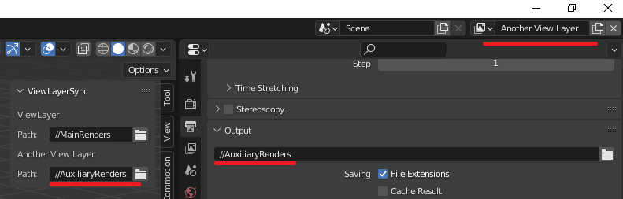
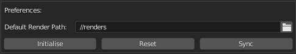

# View Layer Export Sync (Blender Addon)

## Motivation

A useful way of utilising view layers is to make subsets of renders easy to manage.
For example when doing compositing it can be useful to only select and render specific objects.
Currently Blender does not directly support multiple render output paths, so I have created an addon
that makes this slightly easier to work with.

## Description

By selecting a view layer the linked path will automatically be loaded into the render path setting.

If no path is explicitly defined, a defulat can be set in the Addon Preferences

## Known issues

There are some limitations in the Blender api that make this a little bit difficult.
For example, (as far as I could find) there is no event that can be registered to fire automatically when the view layer is changed or when view layers are added or removed. Because of this the synchronisation has not yet been implemented.
For now, the solution is to define all necessary view layers. Then reset the mappings in the Addon Preferences menu. **This will reset all paths (for now)**. Then the setup can be made as desired. While this is not perfect by any stretch, it should make certain workflows much easier and more efficient.

Also, I wanted to have the render folder path only be changed when a render is actually started, but since the `render_pre` and `render_init` handlers are not context aware enough to be able to resolve the currently selected view layer this unfortunately does not work.

## TODO

- Improve manual synchronisation in case of newly added and removed view layers
    - This should be relatively easy since it is just a comparison between current and previous entries.
    - It becomes more complex when renaming is involved.
- Implement automatic synchronisation between view layers and path mappings.
    - Keep added, removed and renamed view layers in sync with the correct path.
- Move the menu from the N-sidebar to the render settings menu